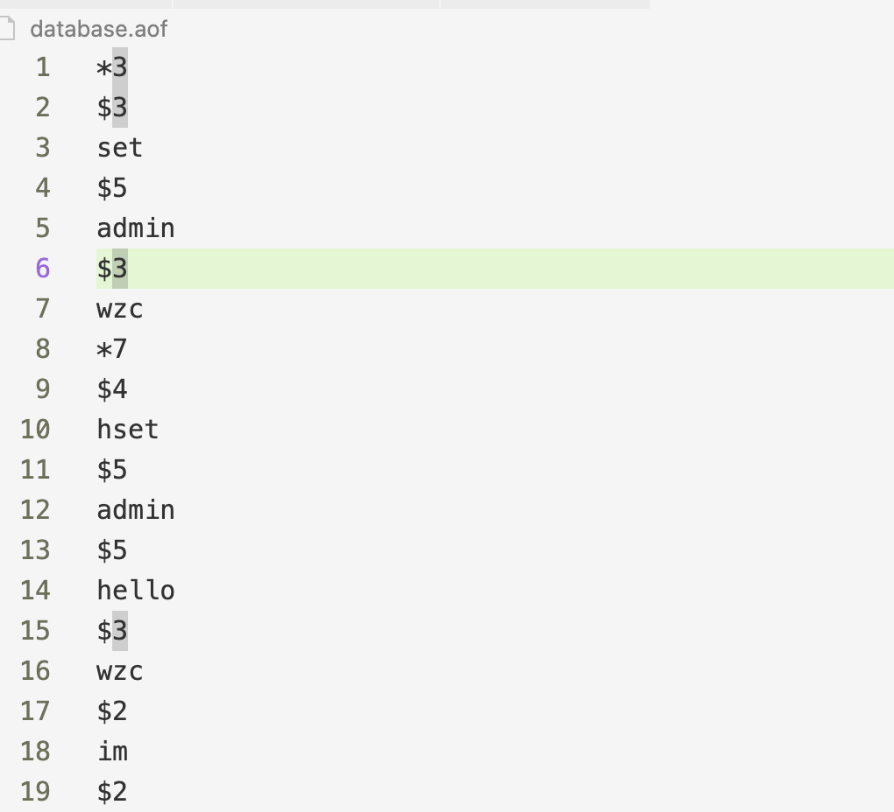

> 写到前面：此仓库参考 https://www.build-redis-from-scratch.dev/en/aof 实现

> 发现还有其他可扩展的内容，并且有一个系统帮助学习，挺好的：https://app.codecrafters.io/courses/redis/introduction?repo=46bb227a-b3c4-4564-9579-deb734e1e7b6

# Redis Clone

A seris of articles about how to implement an In-Memory Database like Redis in Go.

# Supported Languages
- [Arabic](https://www.build-redis-from-scratch.dev/ar/introduction)
- English (soon)

# Install

- Clone the repo
```bash
git clone git@github.com:ahmedash95/build-redis-from-scratch.git
```

- Run the server
```bash
go run main.go
```

- Run the client
```bash
redis-cli
```

## self test

手动启动了一次进行验证。

1. 首先要初始化 go module

```bash
go mod init xxxmodule
```

2. 启动服务

```bash
go run .
```

> 试了下 go run  main.go 不知道为什么失败，可能是 go 的设置问题，先不管

3. 下载 redis cli

如果没有，就先 brew install redis

4. 连接服务

```bash
redis-cli -h localhost -p 6379
```

5. 测试结果

```bash
~ » redis-cli -p 6379 -h localhost                                                   ktpro@KTprodeMacBook-Pro
localhost:6379> ping
PONG
localhost:6379> set admin wzc
OK
localhost:6379> get admin
"wzc"
localhost:6379> PING "admin wzc"
admin wzc
localhost:6379> hset admin wzc 985
OK
localhost:6379> hgetall admin
1) "wzc"
2) "985"

```

6. aof 持久化验证

生成当前项目目录的 database.aof 文件中，通过 $n 的形式指定命令和 key 和 value。和序列化和反序列化方式有关。



